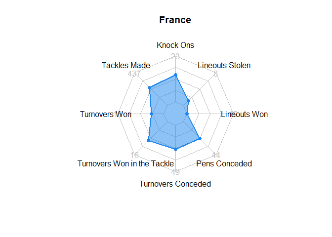

6 Nations, 3 Games - Data Analysis and Visualisation of Women’s Rugby
using R
================
true

# Introduction

In a “normal” world the Women’s Rugby World Cup (RWC) 2021 would start
in New Zealand in October 2021. However, due to the COVID-19 pandemic,
the tournament is now rescheduled to October 2022, with a few spots
still open for national teams across continents. Representing Europe so
far are England, France and Wales, who won their spots through direct
qualification following their top-7 placement in the previous RWC. One
more place representing Europe is still to be assigned to the best team
that will emerge from a qualification round-robin tournament among
Ireland, Italy, Scotland and Spain.

All the seven teams that we have just mentioned compete, or have
competed at some point, in the European “Rugby’s Greatest Championship”,
the Women’s Six Nations (W6N). Similar to the men’s tournament, the
original tournament started as a Home Nations Championship in 1996
between Ireland, England, Scotland and Wales. It was extended to France
in 1999, until the W6N was born in 2001 with the final addition of
Spain. After five editions, in 2006 Italy won their spot in the
championship on merit, having overtaken Spain in the Women’s World
Ranking (WWR).

The goal of this project was to showcase how R/RStudio can be used to
carry out deep data exploration and visualisation of W6N match
performance indicators and in doing so, potentially identify strengths
and weaknesses in Ireland’s playing style that could then be used to
improve their chances of qualifying for the Women’s Rugby World Cup in
2022.

## Data

To collect data for the project, we used the tool [YouTubeCoder by FC
Python](https://fcpythonvideocoder.netlify.app/?pitch=rugby). This tool
involves inputting the YouTube URL of a sports game and noting when
specific events occur using the pitch marker. With this tool, you can
select which type of pitch the game will be played on. There are buttons
for each player and each event that you use to mark the pitch to record
details of the events, including the location on the pitch where the
event occurred. When the match is over, the data recorded can then be
exported into a CSV file that can then be imported into R.

We also sourced data from the following websites:

  - Team and match statistics from the [Six Nations
    website](https://www.sixnationsrugby.com/women/statistics-2021/) in
    order to compare and contrast each competing team’s losses and
    achievements.
  - Match results from the [Livesport
    Website](https://www.livesport.com/en/rugby-union/europe/six-nations-women-2019/results/).
  - Women’s World Ranking data came from the [World Rugby
    website](https://www.world.rugby/tournaments/rankings/wru).

## Data Analysis Software

All analysis was carried out exclusively in RStudio. The primary data
manipulation package used was dplyr, with ggplot2 the primary data
visualisation package. Various other packages were also used. The final
report was then written using R Markdown and published via
[RPubs](https://rpubs.com/).

# Women’s World Rankings

The purpose of this section is to provide some background and context to
each teams’ playing ability by providing a detailed analysis of their
World Rankings and overall performance in the 2018, 2019, 2020 and 2021
W6N tournaments.

Calculations to maintain the WWR are complex and take a number of
factors into consideration, as explained in the [World Rugby
website](https://www.world.rugby/tournaments/rankings/explanation).
However, W6N championship performance and WWR seem to be more
interlinked than what happens for the Men’s Six Nations. We wanted to
investigate how a team’s ranking and performance metrics correlated.

Overall team performance in W6N 2018 - 2021 (see line graph on left
below) shows at first glance how England had a consistent top
performance with only one second placement to the benefit of France. At
the other end of performance lines is Scotland, who always concluded the
tournament in fifth or sixth position. What happens in between is a
series of swinging performance of the remaining four teams.

When teams’ WWR is considered before and after each W6N tournament
however, the line graph on the right below shows how nations compete on
three (possibly four) levels, with England sitting on top of the WWR
almost regardless of the tournament’s outcome, France enjoying similar
safety a couple of ranking positions below, with Scotland being
consistently the last in the WWR among the tournament participants.
Ireland, Italy and Wales instead seem to be those really competing for a
better WWR placement year after year.

<!-- -->

As we combine performance and ranking stats together for each
participant team (see plots below), we can also observe how the outcome
of the tournament had no effect on England’s ranking in any of the years
considered, caused a one place negative change in ranking for France in
2019 after their drop from first to fourth W6N placement, with more
evident ranking fluctuations for the remaining Nations. Wales in
particular saw their ranking change every year after the W6N and shares
with Ireland the largest fluctuation of two ranking spots gained or
lost.

Considering that the W6N is the most important tournament of the year
for these national teams, apart from the World Championship every four
years, can we explain the different effect that a team’s performance has
on their ranking after the tournament?

We looked at two important components of each team’s performance: total
wins (home wins + away wins) and points difference (points for – points
against) as two separate predictors of their WWR after the W6N
championship. However, neither variable seems to offer a good answer to
our question, with Ireland and Scotland escaping any possible prediction
in both linear regression models below that portray those teams as
consistently “under-ranked”. At the opposite end Italy looks
“over-ranked”, especially when points difference is considered.
Although, the point difference regression model fits well to the WWR
assigned to France and Wales.

We also explored each Nation’s home/away win level and points for/points
against level by visualising these components of each team’s performance
across the years using the radar charts below. Note that variables were
normalised in order to offer a comparable view as opposed to what would
have been produced if we used absolute numbers with different scales and
ranges for each variable.

The interactive radar charts that we derived from this analysis show how
England is consistent in all four KPIs, minimising points against and
maximising the other three factors. France is also strong across the
factors considered, apart from a huge slip in 2019 when the team
recorded a peak in points against. Ireland and Italy have very
convoluted results; however, a highlight of Ireland’s performance is a
lack of away wins in 2018 and 2020. On the contrary, away wins are a low
but consistent presence in Italy’s radar chart. Scotland spikes almost
exclusively on the direction of points against, with occasional away
wins in 2018 and home wins in 2021. With a peak of away wins in 2019 and
occasional home wins in 2018 and 2019, Wales shows how low scores are an
issue with their performance (minimal points-for) and they struggle with
defence (overlapping peak of points against across the four years).

<!-- -->

# Women’s Six Nations 2021

This section carries out data exploration and data visualisation of the
2021 Women’s Six Nations Tournament. We begin by analysing each teams’
overall performance before deep-diving into Ireland’s performance in the
three matches they played against Italy, Wales and France.

## A Comparison of Team Performance Indicators

This section provides an overview of each teams’ overall performance in
the 2021 W6N. Several performance indicators are available from the [Six
Nations
website](https://www.sixnationsrugby.com/women/statistics-2021/). We
used radar charts to compare the following performance indicators (see
definitions at the [Ruck
website](https://www.ruck.co.uk/rugby-glossary-a-dictionary-of-rugby-terms/))
for Ireland, Wales, Italy and France (note that these teams were chosen
because Ireland played each of these teams in the 2021 W6N).

  - Tackles Made
  - Knock Ons
  - Lineouts Stolen
  - Lineouts Won
  - Penalties Conceded
  - Turnovers Conceded
  - Turnovers Won in the Tackle
  - Turnovers Won

Italy had the highest number of knock ons, turnovers conceded and
penalties conceded, all of which would have given the opposition
advantage and negatively impacted Italy’s performance. We can also see
Italy made the most tackles but this didn’t lead to a high number of
turnovers won. In comparison we can see Wales also made a lot of tackles
and also won many turnovers. Wales had a strong advantage in relation to
knock ons and penalties conceded and we can also see they didn’t concede
many turnovers. One area where Wales could improve is winning the
lineouts.

France had a very good performance and came second in the tournament but
comparing their turnover metrics to the other teams does not seem to
suggest this. This is probably because France had possession a lot more
and there was no need for them to turn the ball over. France did have
quite a few knock ons and their tactics in relation to lineouts could
also be improved.

Ireland made fewer tackles compared to the other teams but were much
better at turning the ball over. They were also very good at stealing
lineouts from the other team. Areas where they could improve are in
relation to knock ons and penalties conceded.

## A Deep-Dive into Turnovers

Turnovers are a key feature in rugby matches as they are the moments
when a team can transform defence into attack. A turnover won often
leads to a team taking advantage of suddenly gained momentum to resolve
into a try, or it can be key to neutralise dangerous phased attacks
within 10 metres from the try line. Being a highly strategic feature of
the game, turnovers have numerous nuances that often [characterise a
team’s style of play](https://www.rugbyworldcup.com/news/464334). Given
the importance of turnovers, we wanted to carry out a deeper analysis
into Ireland’s turnover-related performance when they played against
Wales, Italy and France in the 2021 W6N.

For clarity, a turnover is defined as follows: when a team concedes
possession of the ball they are said to have turned the ball over to the
other team. This can happen due to defending players stealing the ball
in various ways including: tackling an attacker, the attacker knocking
the ball on, the defending team stealing the ball during a lineout,
etc….

Each of the three analysts on this project took responsibility for one
of Ireland’s games and used the FC Python YouTubeCoder tool to track
turnover related data during that match. To keep our analysis at
conversational level, we decided to define turnovers in line with a [Six
Nations pre-match media report
template](https://d2cx26qpfwuhvu.cloudfront.net/sixnations/wp-content/uploads/2021/02/23161036/Wales-v-England-Six-Nations-EN-Pre-Match-Report.pdf),
which targets a wide media audience with informative and easily
understood content.

The following performance indicators were recorded for each match:

  - **Opposition**: indicates Ireland’s opposition and takes a value of
    “Wales”, “Italy” or “France”.
  - **Team who won turnover**: indicates whether Ireland or their
    opposition won a turnover.
  - **Turnover method**: indicates the method by which the turnover was
    won. Takes possible values of “kick”, “penalty”, “lineout”,
    “tackle”, “knock-on” and “scrum”.
  - **X/Y**: this records the X/Y location of where the turnover
    happened on the pitch.
  - **Min/secs**: records the time at which the turnover happened in the
    match.
  - **Quarter**: indicates if the turnover happened in the 1st, 2nd, 3rd
    or 4th quarter of the match. Each quarter represents 20 minutes.
  - **Num passes before turnover**: the number of succesful passes made
    between players before a turnover occurred.
  - **Num tackles before turnover**: the number of tackles made before a
    turnover occurred.

First, we analysed the total number of turnovers won and lost by each
team across the entire W6N tournament. The barchart on the left below
shows the number of turnovers won by team. Ireland won the most
turnovers of the season. Scotland won the fewest. The number of
turnovers won didn’t necessarily indicate a successful game. For
example, when France played Ireland they didn’t have a high number of
turnovers won but had an impressive winning performance. They managed to
retain possession of the ball throughout most of the match which led to
fewer turnovers.

The barchart on the right below shows the number of turnovers conceded
per team. Italy conceded the most, with Wales conceding the fewest.
Similarly to the turnovers won statistics, few turnovers conceded didn’t
mean that a team was more successful. Wales ranked last in the final
classification of teams despite their relatively low number of turnovers
conceded.

We then analysed the data collected via the FC Python YouTubeCoder tool,
which allows us to analyse turnover-related data for the 3 matches that
Ireland played. The heatmap below was made using geomtile() and shows
how frequently each team achieved their turnovers using each method. The
darker shades indicate more frequent occurrences, with lighter shades
denoting less frequent occurrences (note that Ireland played in all 3
matches and so the heatmap shows their average number of turnovers by
method, in order to provide a fair comparison against other teams). From
viewing this we can see that Ireland and Wales achieved a number of
turnovers from penalties whereas France and Italy won no turnovers this
way. France also did not win any turnovers via scrums, unlike the other
teams.

<!-- -->

### Ireland vs France

We now go even deeper into our analysis of turnover-related indicators
by analysing Ireland’s tactics in each of the three games they played.
The first game analysed here was played against France. The heatmaps
below show the location of turnovers won by Ireland and France in the
first and second half of the match. The black arrows on the heatmaps
indicate the direction Ireland was playing in for that half.

During the first half, most of the turnovers won by France were on the
middle of the pitch towards Ireland’s goal posts. Some were also won on
the top right quarter of the pitch, close to their goal post.

Ireland made very few turnovers during the first half of the match, but
they were spread more across the pitch. Their turnovers were
concentrated to the middle of the pitch vertically but also expanding
over the majority of the right half of the pitch.

During the second half, France’s turnovers spread over a larger area,
but made much fewer turnovers than Ireland. Ireland were more
concentrated, with most of their turnovers happening top and centre of
the field.

### Ireland vs Italy

Now looking at the Italy match, in a game characterised by a flow of
handling errors on both sides, turnovers won by Ireland occurred mostly
at midfield and on the blindside in both halves of the game. This
suggest how their influence on both the attack and defence strategy of
the Girls in Green was very low.

A similar pattern is visible in the density map of turnovers won by
Italy in both halves of the match. The turnover area is slightly more
heavily spread across and positioned deeper in the Italian defensive
zone, as a backwards protective response.

What we observed in relation to the density maps above is confirmed by a
visual breakdown of turnovers by type shown in the two plots below.
There is a variety of different types of turnover in the first half of
the game, however knock-on turnovers are the most frequent feature for
both teams. In the second half, they become almost the exclusive type of
turnover, thus confirming how handling errors increased along with the
time played.

<!-- -->

### Ireland vs Wales

Below we can see where turnovers were won in the final match played
against Wales. The most turnovers were won by Wales in the first half on
the left wing. Ireland were able to get the ball into Wales’ inner third
before they were turned over. In the second half we can see that Ireland
were able to get closer to the goal line before being turned over by
Wales, with most of Wales’ turnovers being around the 22m line. In
contrast most of the turnovers won by Ireland were in the middle of the
pitch in the first half and in Wales inner third in the second half
showing how Wales struggled to get close to their end line to score
tries.

The graphs below show the positioning of different turnovers. We can see
that turnovers that happened on the wings are usually from kicks and
lineouts, while turnovers in the middle of the pitch are usually from
tackles. There is no obvious difference here between Ireland and Wales
style of play, we can see that kicks are a feature of both of their
tactics due to turnovers won from kicks and usually lineouts are a
result of kicks as well. Wales lost the ball three times from knock-ons,
twice in the first half and once in the second half. Ireland lost the
ball five times from knock-ons, all in the second half. In the second
half we can see that the ball was turned over more by tackles.

<!-- -->

Digging deeper into the turnover methods, we also created the barcharts
below to look at the average number of passes and tackles before a
turnover to determine if there is any association between phases and
turnover method. We can see that Ireland will pass more before kicking
the ball with an average of 7 passes before kicking whereas Wales had an
average of 2 passes before kicking. Ireland also had more passes before
losing the ball to a tackle, which illustrates that Ireland were better
at getting tackles in quick compared to Wales.

<!-- -->

Data on the number of tackles before a turnover was won reinforces what
we learned from the passing data. The barcharts below show that
Ireland’s tackling helped them win the ball back quicker than Wales
and Wales had to tackle more before forcing Ireland to kick the ball.

<!-- -->

# Other Analysis & Future Research

Although the main focus of this project was to analyse turnover-related
performance indicators, we also explored other areas. For example, the
line graph below shows the cumulative scores throughout the Ireland vs
Wales match. Wales did not score at all and we can see a lull in
Ireland’s scoring for a period of over 40 minutes between the 30th and
80th minute.

<!-- -->

The following plot shows the location of Ireland’s attempts at
converting a try when playing against wales. We can see that Ireland
missed 2 out of 7 conversions, with both misses taken close to the wing.

<!-- -->

There are many other things which could be done using video analysis
data. We decided to analyze turnovers but we also could have looked at
tries and what happened before a try to know what team’s were doing well
in regards to this. Individuals also could have been tracked to see
where players were contributing most positively to the game and what
their strengths and weaknesses were in relation to tackling, passing and
turnovers.

In relation to the performance/ranking analysis, we considered only four
years of data. Considering a longer period of time or breaking down the
dataset by game may offer additional information on what KPIs are better
predictors of a team’s WWR.

# Limitations

One limitation of this project was the lack of time to run a reliability
test on the data captured using the FC Python YouTubeCoder tool.
Normally sports analysts would watch the game multiple times or another
analyst would watch the same game and record the same events. The
results of each iteration would be compared to find any discrepancies or
unreliable data. Due to time constraints and as this project was focused
on learning and using R we decided not to run reliability tests and
focus on visualization and analysis in R using the data we have. If we
had more time, we may have conducted reliability tests.

Also if we had more time we could have analyzed more games in detail
which would have given us a larger dataset to allow us to create models
to predict a team’s performance. One thing we would have liked to
explore was to use the team’s Six Nation’s performance to predict which
team could secure the last available place for the Women’s Rugby World
Cup. Due to the lack of historical data, time and the anomaly of 2020
and 2021 data due to COVID-19 we decided not to do this.

# Conclusion

Undertaking this project allowed us to experience sport performance
analysis and how R can be used to analyse sports matches such as the
Women’s Six Nations. We gained further understanding of the process of
sports analysis from using the FC Python YouTubeCoder tool to collect
data on specific match events, which then led to creating visualisations
and making inferences from the data.

Our findings allowed us to confirm existing beliefs, for example, that
England would perform well and Scotland would take a low position. It
also allowed us to make new realisations, such as that tackles don’t
always lead to dominance and that a high number of turnovers doesn’t
necessarily indicate successful play.

As mentioned in the Limitations section, the scope of the project was
constrained by time. There is a lot more that we could have explored and
there is definitely potential to take matches such as the Six Nations
and explore them much further.

Overall, this was an interesting and insightful introduction to the
field of sport performance analysis.
